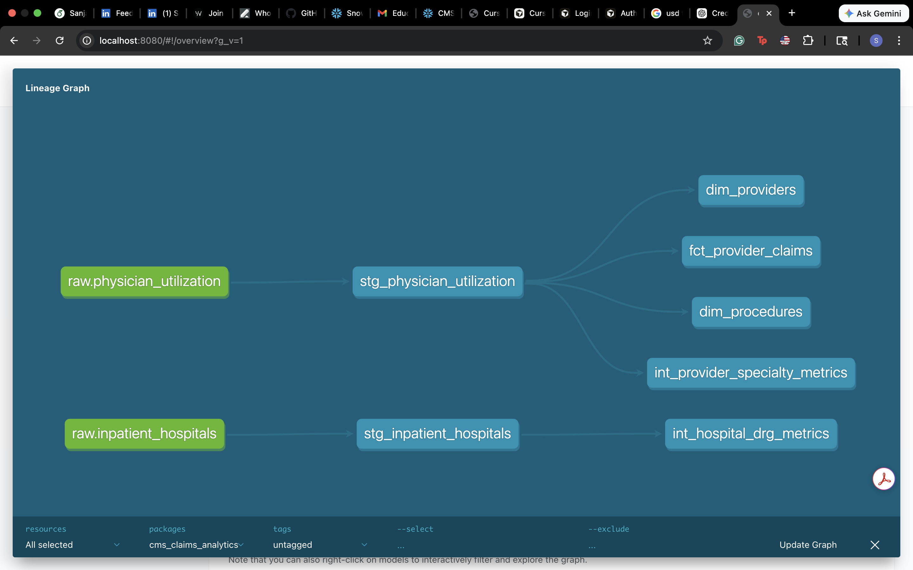

# Healthcare Claims Analytics Platform

An end-to-end ELT analytics pipeline for CMS Medicare public data using **Snowflake** and **dbt**, implementing medallion architecture with automated data quality testing.

## Architecture

```
CMS Public Data (CSV — 9.8M rows)
        ↓  LOAD (Python + Snowflake PUT/COPY)
Snowflake Cloud Data Warehouse
        ↓
┌─────────────────────────────────────────────────────┐
│                    dbt Pipeline                      │
│                                                      │
│   ┌─────────────┐                                   │
│   │  RAW LAYER   │  Raw CMS data as-is              │
│   │  (Bronze)    │  physician_utilization            │
│   │              │  inpatient_hospitals              │
│   └──────┬───────┘                                   │
│          ↓                                           │
│   ┌──────────────┐                                   │
│   │STAGING LAYER │  Cleaned, renamed, typed          │
│   │              │  stg_physician_utilization        │
│   │              │  stg_inpatient_hospitals          │
│   └──────┬───────┘                                   │
│          ↓                                           │
│   ┌──────────────┐                                   │
│   │INTERMEDIATE  │  Aggregated, business logic       │
│   │   LAYER      │  int_provider_specialty_metrics   │
│   │              │  int_hospital_drg_metrics         │
│   └──────┬───────┘                                   │
│          ↓                                           │
│   ┌──────────────┐                                   │
│   │ MARTS LAYER  │  Final analytics tables           │
│   │  (Gold)      │  fct_provider_claims              │
│   │              │  dim_providers                    │
│   │              │  dim_procedures                   │
│   └──────────────┘                                   │
│          ↓                                           │
│   ┌──────────────┐                                   │
│   │  dbt TESTS   │  8 automated quality checks       │
│   │              │  unique, not_null validations     │
│   └──────────────┘                                   │
└─────────────────────────────────────────────────────┘
        ↓
Power BI Dashboard (provider payment variance, claims trends)
```

## Data Schema

### Fact Table: `fct_provider_claims`
| Column | Type | Description |
|--------|------|-------------|
| provider_npi | VARCHAR | National Provider Identifier |
| provider_specialty | VARCHAR | Medical specialty (e.g., Internal Medicine) |
| provider_state | VARCHAR | Two-letter state code |
| provider_city | VARCHAR | City name |
| hcpcs_code | VARCHAR | Procedure code |
| hcpcs_description | VARCHAR | Procedure description |
| total_beneficiaries | INTEGER | Number of unique Medicare patients |
| total_services | INTEGER | Number of services performed |
| avg_submitted_charge | FLOAT | What the provider charged |
| avg_medicare_payment | FLOAT | What Medicare actually paid |
| payment_variance_pct | FLOAT | Gap between charge and payment (%) |
| total_submitted_charges | FLOAT | Total charges (avg * services) |
| total_medicare_payments | FLOAT | Total payments (avg * services) |

### Dimension Table: `dim_providers`
| Column | Type | Description |
|--------|------|-------------|
| provider_npi | VARCHAR | National Provider Identifier (unique) |
| provider_last_name | VARCHAR | Last name or organization name |
| provider_first_name | VARCHAR | First name |
| provider_credentials | VARCHAR | Credentials (M.D., D.O., etc.) |
| provider_specialty | VARCHAR | Medical specialty |
| provider_state | VARCHAR | Two-letter state code |
| provider_city | VARCHAR | City name |
| provider_zip | VARCHAR | ZIP code |
| provider_ruca_code | VARCHAR | Rural-Urban classification |

### Dimension Table: `dim_procedures`
| Column | Type | Description |
|--------|------|-------------|
| hcpcs_code | VARCHAR | Procedure code (unique) |
| hcpcs_description | VARCHAR | Procedure description |
| is_drug_service | VARCHAR | Whether this is a drug service |

### Intermediate: `int_provider_specialty_metrics`
| Column | Type | Description |
|--------|------|-------------|
| provider_specialty | VARCHAR | Medical specialty |
| provider_state | VARCHAR | State |
| total_providers | INTEGER | Count of unique providers |
| total_services | INTEGER | Total services performed |
| total_beneficiaries | INTEGER | Total patients served |
| avg_submitted_charge | FLOAT | Average charge |
| avg_medicare_payment | FLOAT | Average payment |
| payment_variance_pct | FLOAT | Charge vs payment gap (%) |

### Intermediate: `int_hospital_drg_metrics`
| Column | Type | Description |
|--------|------|-------------|
| hospital_state | VARCHAR | State |
| drg_code | VARCHAR | Diagnosis Related Group code |
| drg_description | VARCHAR | DRG description |
| total_hospitals | INTEGER | Count of unique hospitals |
| total_discharges | INTEGER | Total patient discharges |
| avg_covered_charges | FLOAT | Average charges |
| avg_medicare_payment | FLOAT | Average Medicare payment |
| payment_variance_pct | FLOAT | Charge vs payment gap (%) |

## Lineage Graph



## Data Quality Tests

8 automated tests run on every pipeline execution:

| Test | Model | Column | What it checks |
|------|-------|--------|----------------|
| not_null | fct_provider_claims | provider_npi | Every claim has a provider |
| not_null | fct_provider_claims | hcpcs_code | Every claim has a procedure |
| not_null | fct_provider_claims | avg_medicare_payment | Every claim has a payment |
| unique | dim_providers | provider_npi | No duplicate providers |
| not_null | dim_providers | provider_npi | No missing provider IDs |
| not_null | dim_providers | provider_state | No missing states |
| unique | dim_procedures | hcpcs_code | No duplicate procedures |
| not_null | dim_procedures | hcpcs_code | No missing procedure codes |

## Tech Stack

- **Snowflake** — Cloud data warehouse (AWS)
- **dbt Core** — Data transformation and testing
- **Python** — Data loading scripts
- **Power BI** — Dashboard visualization
- **Git/GitHub** — Version control

## How to Run

```bash
# Set Snowflake credentials
export SNOWFLAKE_PASSWORD="your_password"

# Navigate to project
cd "path/to/Project1-Healthcare-Claims-Analytics"

# Test connection
dbt debug

# Run all models
dbt run

# Run tests
dbt test

# Generate and view documentation
dbt docs generate
dbt docs serve
```

## Data Source

[CMS Medicare Provider Utilization & Payment Data (2023)](https://data.cms.gov/provider-summary-by-type-of-service/medicare-physician-other-practitioners/medicare-physician-other-practitioners-by-provider-and-service)

9.8 million rows of real Medicare claims data including physician utilization and inpatient hospital records.
